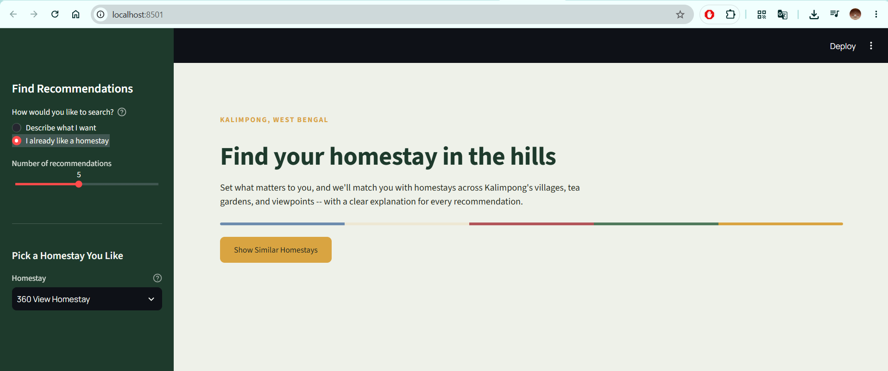
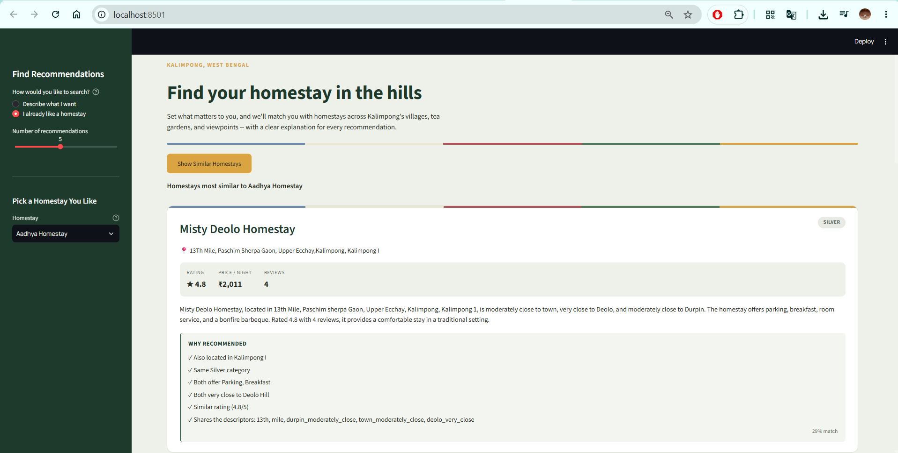
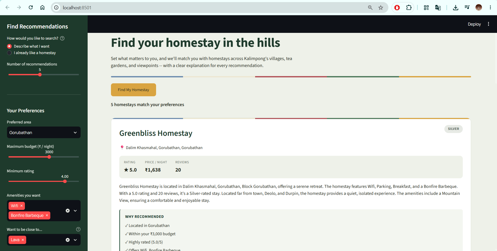

# 🏡 An Explainable Content-Based Recommendation System for Homestays

An AI-powered homestay recommendation system that helps travellers discover suitable accommodations based on their preferences while providing transparent explanations for every recommendation.

This project was developed as part of the **MSc Artificial Intelligence Dissertation** and focuses on building an **Explainable AI (XAI)** recommendation engine for homestays in **Kalimpong, West Bengal, India**.

---

## 📖 Project Overview

With the rapid growth of online travel platforms, travellers are often overwhelmed by the large number of accommodation options available. Traditional recommendation systems may provide suggestions but rarely explain *why* a particular property was recommended.

This project addresses that challenge by combining:

- Content-Based Filtering
- Natural Language Processing (NLP)
- Explainable AI Techniques
- Interactive Data Visualisation

The system recommends homestays based on similarities in:

- Amenities
- Location
- Property descriptions
- Guest experiences
- Pricing characteristics

Alongside each recommendation, the system provides human-readable explanations that improve transparency and user trust.

---

## 🎯 Objectives

- Develop a content-based recommendation engine for homestays.
- Generate personalised accommodation recommendations.
- Improve recommendation transparency through explainability.
- Evaluate recommendation quality using similarity metrics.
- Provide an interactive web interface for end users.

---

## 🏗️ System Architecture

```text
Dataset Collection
        │
        ▼
Data Cleaning & Preprocessing
        │
        ▼
Feature Engineering
        │
        ▼
TF-IDF Vectorisation
        │
        ▼
Cosine Similarity Matrix
        │
        ▼
Recommendation Engine
        │
        ▼
Explainability Layer
        │
        ▼
Streamlit Web Application
```

---

## 📊 Dataset

The dataset contains information about homestays located in Kalimpong, including:

- Homestay Name
- Location
- Description
- Amenities
- Price Information
- Ratings
- Contact Information
- Geographic Coordinates

### Data Processing Steps

- Data cleaning and validation
- Duplicate removal
- Missing value handling
- Amenity standardisation
- Text preprocessing
- Feature aggregation
- Geocoding and location enrichment

---

## 🧠 Recommendation Methodology

### Content-Based Filtering

The recommendation engine represents each homestay using textual and categorical features.

### Feature Extraction

Features include:

- Property descriptions
- Amenities
- Location attributes
- Price categories

### TF-IDF Vectorisation

Textual information is transformed into numerical vectors using TF-IDF (Term Frequency-Inverse Document Frequency).

### Similarity Calculation

Cosine Similarity is used to identify homestays with similar characteristics.

```python
Similarity(A, B) = Cosine(TF-IDF_A, TF-IDF_B)
```

Higher similarity scores indicate stronger recommendation relevance.

---

## 🔍 Explainability Features

Unlike conventional recommendation systems, this project explains recommendations by highlighting:

- Shared amenities
- Similar property characteristics
- Comparable locations
- Matching traveller preferences

Example:

> Recommended because both homestays offer mountain views, free Wi-Fi, family-friendly accommodation, and are located near central Kalimpong.

This improves user understanding and trust in the recommendation process.

---

## 💻 Technologies Used

| Category | Technology |
|-----------|------------|
| Programming Language | Python |
| Data Analysis | Pandas, NumPy |
| NLP | Scikit-learn (TF-IDF tokenisation), Python re module |
| Recommendation Engine | TF-IDF, Cosine Similarity |
| Web Application | Streamlit |
| Description Generation | Qwen 3 via Ollama |
| Development Environment | Jupyter Notebook |

---

## 📁 Project Structure

```text
an-explainable-content-based-recommendation-system-for-homestays/
│
├── data/
│   ├── dataset_reference/
│   ├── figures/
│   ├── final/
│   └── processed/
│   └── raw/
│
├── models/
|
├── notebooks/
│   ├── 00_pdf_to_csv_conversion.ipynb
│   ├── 01_data_acquisition.ipynb
│   ├── 02_data_enrichment.ipynb
│   ├── 03_description_generation.ipynb
│   └── 03a_targeted_regeneration.ipynb
│   └── 04_data_preparation.ipynb
│   └── 05_recommendation_system.ipynb
│   └── 06_evaluation_deployment.ipynb
│
├── app.py
├── requirements.txt
├── README.md
└── assets/
```

## 🚀 Installation

### Clone the Repository

```bash
git clone https://github.com/pranay-sampang/an-explainable-content-based-recommendation-system-for-homestays.git

cd an-explainable-content-based-recommendation-system-for-homestays
```

### Create a Virtual Environment

```bash
python -m venv venv
```

Activate:

**Windows**

```bash
venv\Scripts\activate
```

**Linux / macOS**

```bash
source venv/bin/activate
```

### Install Dependencies

```bash
pip install -r requirements.txt
```

---

## ▶️ Running the Application

Launch the Streamlit application:

```bash
streamlit run app.py
```

The application will be available at:

```text
http://localhost:8501
```

---

## 📈 Evaluation

The recommendation system was evaluated using similarity-based recommendation quality measures and qualitative analysis of recommendation relevance.

Evaluation focused on:

- Recommendation accuracy
- Recommendation diversity
- Explainability quality
- User interpretability

The results demonstrate that explainable recommendations can improve transparency without significantly affecting recommendation quality.

---

## 🌟 Key Features

✅ Content-Based Recommendation Engine

✅ Explainable AI Recommendations

✅ Similarity Score Visualisation

✅ Interactive Streamlit Interface

✅ Amenity-Based Filtering

✅ Location-Based Discovery

✅ Transparent Recommendation Logic

---

## 📷 Application Preview

### Home Page


### Search based Recommendation


### Preference based Recommendation


---

## 🎓 Dissertation Information

**Degree:** MSc Artificial Intelligence

**Project Title:**  
*An Explainable Content-Based Recommendation System for Homestays*

**Author:** Pranay Sampang

**Institution:** London Metropolitan University

**Submission Year:** 2026

---

## 📜 License

This project is developed for academic and research purposes.

Feel free to use the code for learning and research with appropriate attribution.

---

## 🤝 Acknowledgements

- London Metropolitan University
- MSc Artificial Intelligence Programme
- Streamlit Community
- Scikit-learn Developers
- Open-source Python Ecosystem

---

## 📬 Contact

**Pranay Sampang**

GitHub: https://github.com/pranay-sampang

For questions, suggestions, or collaboration opportunities, please open an issue in this repository.